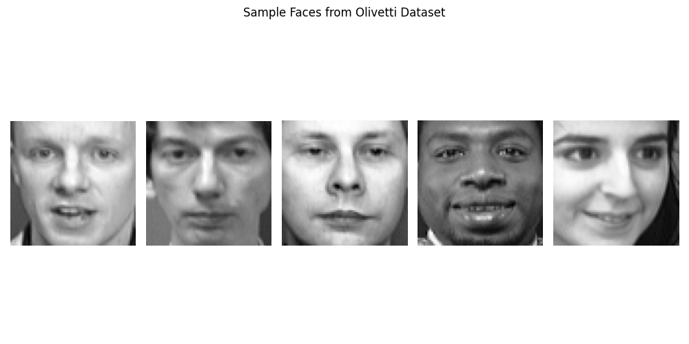
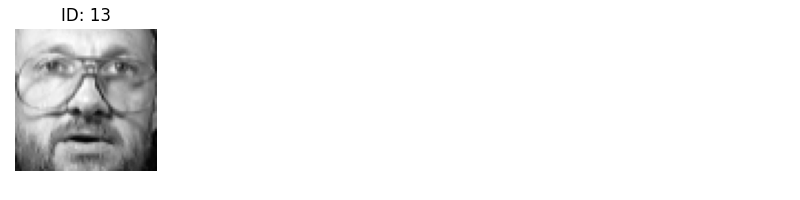
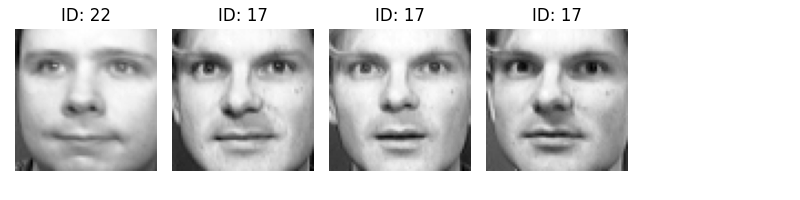
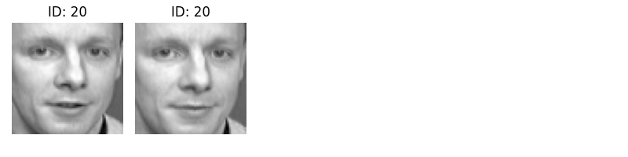

# Face Clustering with PCA and K-Means

## 🧠 Project Overview

This project applies **Principal Component Analysis (PCA)** and **K-Means Clustering** to the **Olivetti Face Dataset**, a classic dataset of 400 grayscale facial images of 40 individuals. The goal is to automatically group visually similar faces together by reducing high-dimensional data and clustering the compressed representations.

### 📌 Objectives:
- Reduce dimensionality of face data using PCA while retaining 99% of variance.
- Perform unsupervised clustering using K-Means.
- Visually evaluate clusters to assess similarity of faces within each group.

---

## 🔍 Dataset Summary

- **Total Images:** 400
- **Image Size:** 64 × 64 pixels (4096 features)
- **Individuals:** 40 people with 10 images each
- **Grayscale Format:** Each pixel is a value between 0 and 1

---

## ⚙️ Methodology

### 1. Data Preparation
- Loaded the dataset using `sklearn.datasets.fetch_olivetti_faces`.
- Flattened each 64×64 image into a 4096-length vector.

### 2. PCA (Principal Component Analysis)
- Applied PCA to reduce dimensionality from 4096 to **198 components**.
- Set `n_components=0.99` to retain 99% of variance.
- Whitening was used to normalize feature variances.

### 📊 PCA Variance Reduction:

### 3. K-Means Clustering
- Performed clustering using K-Means with `n_clusters=120`.
- Each cluster attempts to group visually similar faces.

---

## 👁️ Visualizations

### 🔹 Sample Faces from Dataset

> *A selection of random face images from the Olivetti dataset.*

### 🔹 PCA Compression

> *Scree plot or bar chart showing number of components vs variance retained (optional).*

### 🔹 Cluster Examples

> *Cluster 0: Individuals with glasses.*


> *Cluster 1: Faces with beards and frontal poses.*


> *Cluster 2: Faces with similar pose and lighting.*

> **Observation:** The algorithm grouped faces based on prominent visual traits like glasses, beard, or head pose. Some clusters are surprisingly coherent.

---

## 🧪 Results

- **Dimensionality reduced:** 4096 → 198
- **Clusters created:** 120
- **Successful Groupings:** Faces with common visual traits grouped well (e.g., glasses, facial hair).
- **Issues:** Minor pose and lighting differences reduced accuracy in some clusters.

---

## 👎 Limitations

- High number of clusters (120) may overfit small differences.
- K-Means is sensitive to initial cluster centers.
- Lighting and expression variations slightly affect grouping.
- No direct accuracy metric due to unsupervised nature.

---

## 🚀 How to Run

1. Clone this repository:
   ```bash
   git clone https://github.com/MK3685/face-clustering-pca-kmeans.git
   cd face-clustering-pca-kmeans
